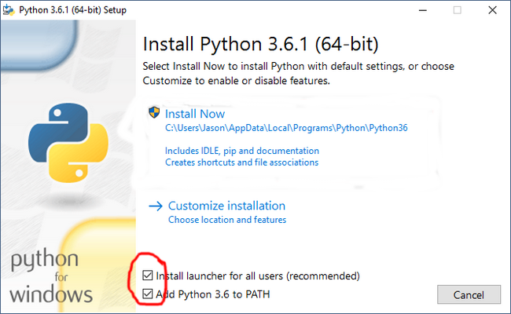

# Python Course Prerequisites

This is a guide on how to install the needed softwares during the python tutorials. 

## Install Python 3.x

Strictly `Python 3.x` is required. 

**Note: DO NOT download `Python 2.x` because they are not compatible.**

### Windows

Download `Python 3.x` installer from [here](https://www.python.org/ftp/python/3.6.4/python-3.6.4.exe) and install it.

Make sure the checkboxes at the bottom of the installation window are ticked. Then click INSTALL NOW.
### Debian (Ubuntu)

Python 3.x comes installed in Ubuntu.

## Install Jupyter

After python 3.x has been installed, open the terminal and install Jupyter

### Windows

There are various ways of opening the terminal, known as CMD in windows. You can use one of thes provided ways:

 - Click `windows + R` and a window will appear on the bottom left side of the screen, type `cmd` then click RUN.
 - Right click the Start button on the bottom left side of the screen, a popup will appear, then choose `Command Prompt`

 Once you have completed one of these steps, an intimidating black window will appear.
 
 Follow the following instructions to install Jupyter.

  1. Do not be intimidated by the screen.
  2. Type `pip install jupyter` on the terminal.
  3. Click Enter and wait as jupyter installs.

### Linux (Ubuntu)

Open the terminal using `ctrl + alt + T`  
First you need to install `pip` before using it.

  1. Type `sudo apt install python3-pip` on the terminal.
  2. Enter your user password and wait as `pip` installs.
  3.Type `pip3 install jupyter` on the terminal and wait as jupyter installs.

Just to verify that jupyter was properly installed, type:

`jupyter notebook` on the terminal. A new tab should be opened on your default browser.

Feel free to open an issue if you encounter any problems.

Regards,   
Kevin Nderitu

